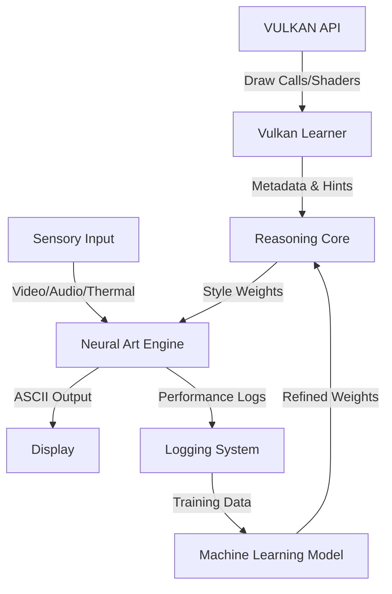

# Integration & DevOps Roadmap: Neuro-Visual System

**Project:** Krystal-Stack / Neural Compositor  
**Focus:** Long-Term Integration, Machine Learning Pipeline, and Deployment  
**Date:** Feb 17, 2026  
**Author:** Dušan Kopecký

This document defines the strategic roadmap for evolving the **Neuro-Visual Transduction Engine** from a standalone prototype into a fully integrated, self-learning ecosystem. It bridges the gap between raw GPU data (Vulkan), Neural Generation, and high-level Reasoning Patterns.

---

## 1. System Architecture: The "Neuro-Visual Loop"

The long-term vision is a closed-loop system where the engine **learns** from its own operation and the underlying graphics pipeline.



### 1.1 Components & Roles
*   **Vulkan Learner:** The raw eye. Inspection of GPU primitives.
*   **Neural Art Engine:** The brush. Generates the ASCII structure.
*   **Logging System:** The memory using `IntraspectralLogger`. Connects pipeline to reasoning.
*   **Reasoning Core:** The brain. Decides *which* style fits the current context (e.g., "Combat requires High-Refresh Sketch Mode").

---

## 2. Integration Roadmap (Functional)

### Phase 1: Signal Unification (Q2 2026)
*Goal: Connect all isolated modules into a single data stream.*
- [x] **Consolidation:** Move `neural_art_engine` and subsystems to `image_generator/`.
- [ ] **Unified Telemetry:** Update `main_ar_system.py` to log events to the central Gamesa Logging System or Kafka.
- [ ] **Vulkan Bridge:** Replace the mock `vulkan_learner.py` with a C++ Shared Library (`vulkan_hook.so`) that intercepts real draw calls.

### Phase 2: The feedback Loop (Q3 2026)
*Goal: Enable the system to self-adjust based on performance.*
- [ ] **Auto-Tuning:** If `latency > 33ms`, the Reasoning Core automatically downgrades the Neural Art Engine's kernel size.
- [ ] **Context Awareness:** If `audio_reactor` detects high BPM, `video_processor` switches to "Glitch/Cyberpunk" mode automatically.

### Phase 3: Machine Learning (2027)
*Goal: Train a custom model on the "Reasoning Patterns".*
- [ ] **Data Harvesting:** Collect 10,000 hours of gameplay metadata + generated ASCII.
- [ ] **Training:** Train a lightweight Transformer model to predict the *perfect* ASCII character for any given GPU state.

---

## 3. DevOps Roadmap (Operational)

### Stage 1: Local Deployment (Development)
*Current State.*
- **Environment:** virtualenv (`venv`).
- **Dependencies:** `requirements.txt`.
- **Testing:** Manual script execution (`python3 system/main_ar_system.py`).

### Stage 2: Containerization (Docker)
*Next Step.*
- **Action:** Create `Dockerfile` for the `image_generator`.
- **Base Image:** `openvino/ubuntu20_runtime` (for acceleration).
- **Service:** Deploy as a microservice offering an HTTP API (`POST /process_frame`).

### Stage 3: CI/CD Pipeline (GitHub Actions)
- **Linting:** Automatic `pylint` on commit.
- **Safety:** Scan `requirements.txt` for vulnerabilities.
- **Artifacts:** Build `.deb` package for Debian/Ubuntu deployment.

---

## 4. Reasoning Patterns & logging

To facilitate Machine Learning, every major decision must be logged with **Context**.

**Log Structure Example:**
```json
{
  "timestamp": "2026-02-17T20:30:00Z",
  "vulkan_state": { "vertex_count": 50000, "shader": "compute" },
  "thermal_state": { "cpu_temp": 65.0, "penalty": 0.2 },
  "decision": { "mode": "cyberpunk", "kernel": "sobel_v2" },
  "outcome": { "latency": 15.4, "user_rating": "implied_positive" }
}
```
This structured data allows the ML model to learn: *"When vertex count is high and temp is moderate, Cyberpunk mode is sustainable."*

---

## 5. Summary
We are moving from a set of cool scripts to a **Cognitive Graphics System**. The key is to treat the ASCII output not just as art, but as the result of a **Reasoned Decision** made by the system based on hardware and software telemetry.
