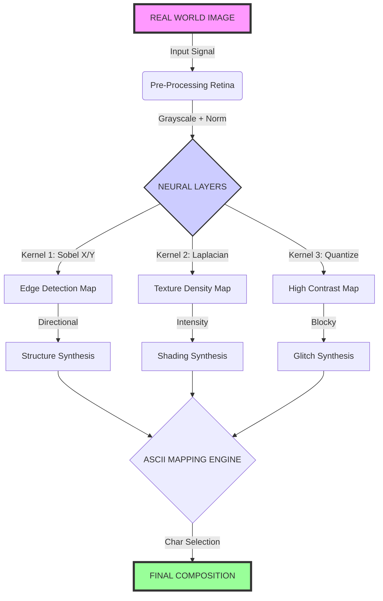

# Neuro-Visual Transduction Architecture

**System:** Neural Compositor Paradigm  
**Flow:** Reality → Convolution → Semantic Structure

This diagram illustrates the transformation of visual signals into ASCII meaning.

## Layer Breakdown

1.  **Input Reality:** A standard RGB bitmap (photograph or video frame).
2.  **Retina (Pre-processing):** Converts color space to luminance (grayscale), removes high-frequency noise that would translate to "character jitter."
3.  **Neural Layers (Convolution):**
    *   **Sobel Filters:** Calculate the gradient vector at every point. This tells us *which way* a line is pointing.
    *   **Laplacian Filters:** Calculate the second derivative (rate of change). This identifies fine texture (hair, grass, fabric).
4.  **Synthesis:**
    *   **Sketch Mode:** Uses only the *Direction* data (Sobel). Draws lines.
    *   **Standard Mode:** Uses *Intensity* data (Laplacian). Shades areas.
    *   **Cyberpunk Mode:** Uses *Quantized* data (Posterization). Creates blocks.
